# Motion walkthroughs

Six walkthroughs, each built up a step at a time, with a real frame of what each step makes.
Every script here is in `examples/motion/`, so you can run any of them and change them.

1. [Your first video, the simple way](#1-your-first-video-the-simple-way): a brand, beats and an end card
2. [Mix and match](#2-mix-and-match): two things in one beat, and a style or theme per beat
3. [An announcement film, beat by beat](#3-an-announcement-film-beat-by-beat): the `announcement` style
4. [Motion graphics by hand](#4-motion-graphics-by-hand): the full format, one layer at a time
5. [A hero from real recordings](#5-a-hero-from-real-recordings): kaviri's own takes on every device, in the `launch` style
6. [An internal launch template](#6-an-internal-launch-template): variables, random picks and variants

Each one uses the same loop, and it is worth making a habit:

```sh
kaviri motion --script video.jsonl --check                          # is it valid? how long?
kaviri motion --script video.jsonl --still 2,10,18 --out look.png   # look at moments
kaviri motion --script video.jsonl --out video.mp4                  # render it with sound
```

---

## 1. Your first video, the simple way

**The file:** `examples/motion/simple.jsonl`. **The reference:** `docs/motion-simple.md`.

### Step 1: the brand

```jsonl
{"op":"brand","name":"kaviri","accent":"#c7361a","theme":"light","url":"kaviri.dev","logo":"../../brand/logomark.svg"}
```

One line says who this is for: a name, one colour, light or dark, the url and a logo for the
end card. Nothing is on screen yet, but everything after this line uses it.

### Step 2: the first beat

```jsonl
{"op":"beat","text":"Demos go [stale.]","sub":"The UI moves. The video does not."}
```

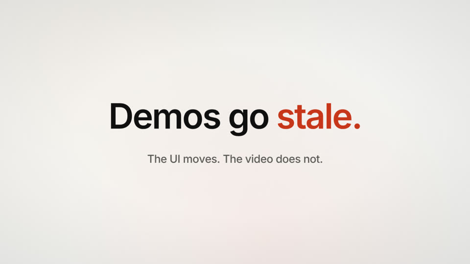

A beat is four seconds. The words in square brackets take the accent colour. With no `show`,
the headline gets the whole frame and a smaller `sub` line below it. The headline is sized to
fit, however long it is.

### Step 3: beats that show something

```jsonl
{"op":"beat","text":"Nobody [re-records] it.","show":{"strike":["Block out an afternoon.","Find a quiet room.","Get the mouse path right on the fourth take."]}}
{"op":"beat","text":"Your demo video is a [build artifact.]","show":{"image":"site/hero.png"}}
{"op":"beat","text":"Write the take down. [Run it in CI.]","show":{"code":"…","title":"examples/demo.jsonl","lang":"json"}}
{"op":"beat","text":"The build fails if the take [filmed nothing.]","show":{"list":["Record demo.jsonl","Render demo.mp4","Compare first and last frame"]}}
{"op":"beat","text":"The recorder is [free.]","show":{"chips":["Apache 2.0","No account","Nothing phones home"]}}
```

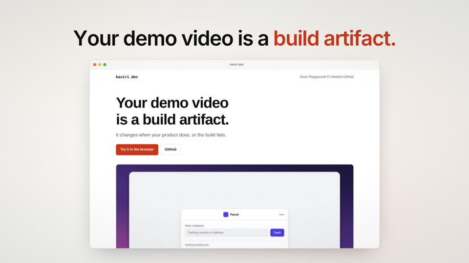

`show` puts one thing under the headline: lines that get crossed out, a screenshot in a
browser window, code that types itself, a checklist that ticks, chips that pop. The **third
beat is the drop**: the music hits there, so the product reveal goes there.

### Step 4: the end card, then render

```jsonl
{"op":"end","tagline":"Your demo video is a [build artifact.]"}
```

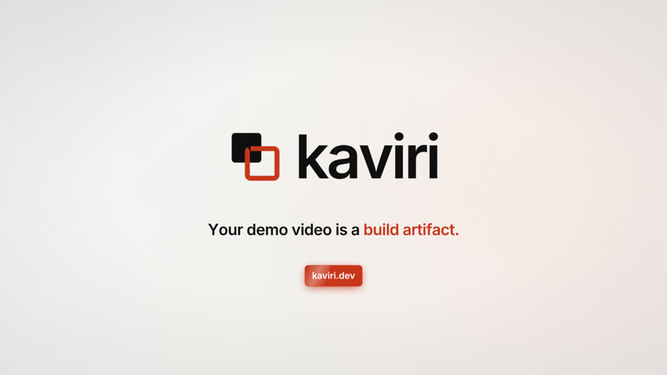

The end card sets the logo beside the name, then the tagline and the url. Run `--check`: it
prints the length (28 seconds here) and where each beat starts. Then render. The music is
written for these beats: an intro under the first, a build under the second, the drop on the
third, and an outro under the end card.

### Step 5: try another style

```jsonl
{"op":"brand","name":"kaviri","accent":"#c7361a","style":"brutalist","url":"kaviri.dev"}
```

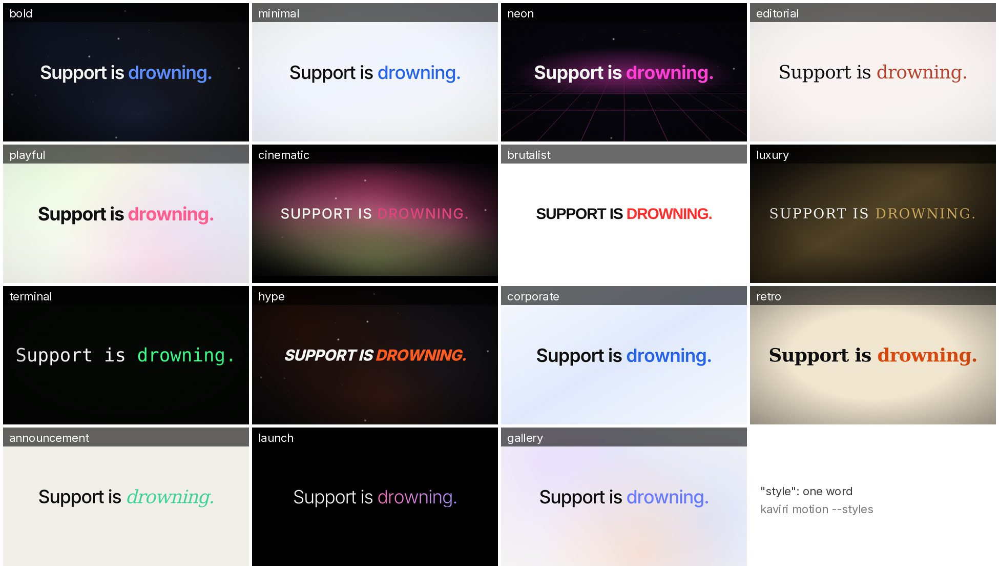

Change one word and the whole video changes: how text enters, how scenes cut, the ground, the
typeface, the drop, the music. `kaviri motion --styles` lists them. The accent colour matters
as much as the style: gold suits `luxury`, green suits `terminal`, mint suits `announcement`.

---

## 2. Mix and match

**The file:** `examples/motion/mix.jsonl`.

The brand sets the defaults. A beat can override any of them, and show two things at once.

### A beat in another style

```jsonl
{"op":"brand","name":"Relay","accent":"#e0457b","style":"bold","url":"relay.chat"}
{"op":"beat","text":"Support is [drowning.]"}
{"op":"beat","text":"Your queue, [decoded.]","style":"terminal","show":{"code":"relay triage --inbox support\n✓ 1,204 tickets sorted in 3.1s","title":"relay"}}
```

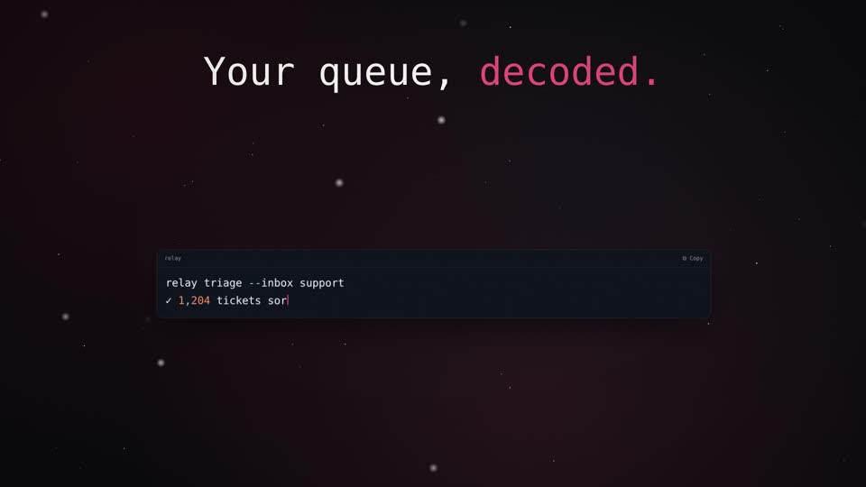

`"style"` on a beat borrows that style's motion and typeface for just that beat: how its
headline enters, how it cuts in, and its drop if it lands on one. The rest of the video keeps
the brand's style.

### A beat on the other ground, showing two things

```jsonl
{"op":"beat","text":"Meet [Relay.]","theme":"light","style":"editorial","show":[{"type":"Summarise this week's tickets"},{"stats":[["92%","auto-resolved"],["8s","first reply"]]}]}
```

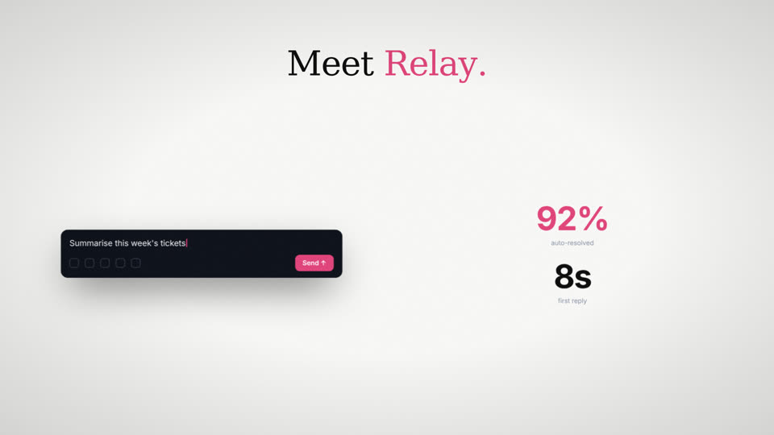

- `"theme":"light"` (or `"dark"`) puts one beat on the other ground.
- `"show"` as a **list of two** puts them side by side (stacked on a vertical video). The
  second one starts half a beat after the first, so the eye goes left, then right.

Any two shows go together. Good pairs: `stack` with `number`, `roll` with `photo`, `type` with
`stats`, `code` with `list`, `image` with `chips`.

---

## 3. An announcement film, beat by beat

**The file:** `examples/motion/announcement.jsonl`. A funding announcement for a fictional
company, in the `announcement` style: scenes take turns on cream and deep green, the accent
words are set in italic serif inside a sans headline, numbers are huge, and the photography is
full bleed.

### The brand

```jsonl
{"op":"brand","name":"Fieldstone","accent":"#3fd39a","style":"announcement","url":"fieldstone.io"}
```

`announcement` alternates the ground by itself: beat 1 is cream, beat 2 is green, and so on.
A beat's `"theme"` still wins when you want two in a row on the same ground.

### Beat 1: a number that counts to where it lands

```jsonl
{"op":"beat","text":"Fieldstone is [announcing]","show":[{"stack":["landscapes/l1.svg","landscapes/l2.svg","landscapes/l3.svg"]},{"number":"$400M","label":"Series F"}]}
```

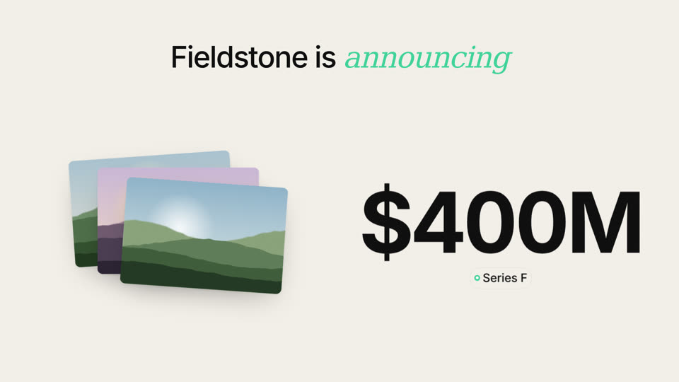

`number` is the biggest figure the frame can hold, counting up from 60% of its value (or
`"from"`) with a long settle, like an odometer landing. `label` sits under it. `stack` fans a
few photos and raises them one after another.

### Beat 2: the roll

```jsonl
{"op":"beat","text":"The road to [Series F]","show":{"roll":["Seed","Series A","Series B","Series C","Series F"]}}
```

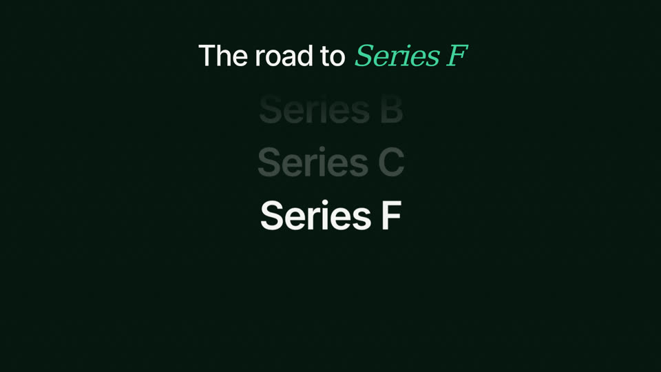

`roll` is a slot machine: the list steps up one line a beat and the line on the centre is lit,
so the last item is where it settles. Use it for a history, a list of customers, or the same
word five times for rhythm.

### Beat 3: the headline alone

```jsonl
{"op":"beat","text":"Valued at [$6.4B]","sub":"Up from $1.5B two years ago."}
```

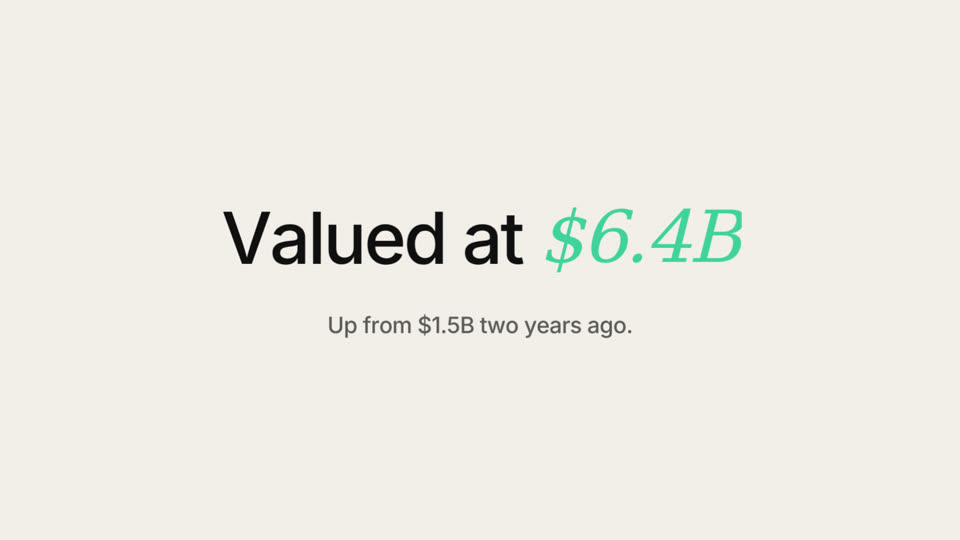

With nothing to show, the headline takes the frame, with the figure in the italic serif.

### Beat 4: a full-bleed photo

```jsonl
{"op":"beat","text":"The [future] of work\nis on Fieldstone","show":{"photo":"landscapes/l5.svg"}}
```

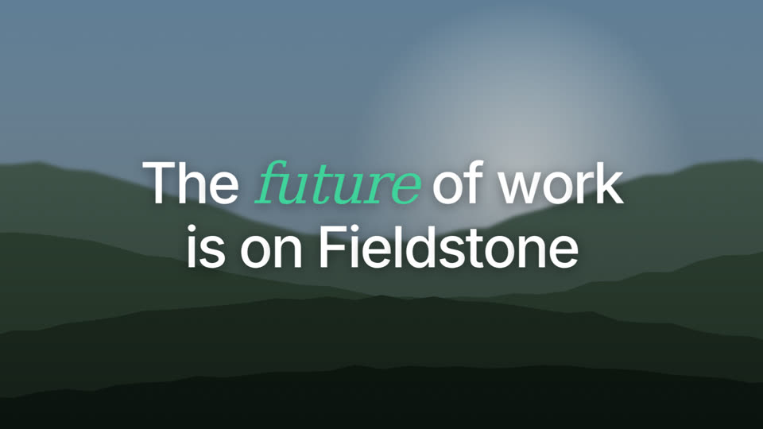

`photo` on its own fills the frame, darkens the bottom for legibility and pushes in slowly;
the headline sits on it in white, resolving out of a dot matrix (`dots`, one of this style's
entrances). `\n` breaks the headline where you want. In a pair, `photo` is a card instead.

### Beat 5: a roll beside a photo

```jsonl
{"op":"beat","text":"Trusted by [the largest]","show":[{"roll":["16 of the largest manufacturers","12 of the largest retailers","10 of the largest banks","9 of the largest airlines"]},{"photo":"landscapes/l4.svg"}]}
```

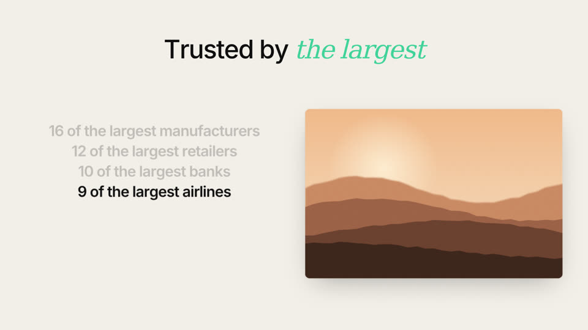

### The end card

```jsonl
{"op":"end","tagline":"The [calm] control plane for busy teams."}
```

The tagline takes the italic serif accent too. Render it and the music (energetic, the style's
default) is fitted to the six scenes.

---

## 4. Motion graphics by hand

**The files:** `examples/motion/walkthrough/step1.jsonl` to `step4.jsonl`. The reference is
`docs/motion-llm.md`.

The simple way expands into the full format. Writing the full format yourself gives you every
layer, every keyframe and every sound. Here is one video built up a layer at a time.

### Step 1: a scene and a headline

```jsonl
{"op":"video","size":[1920,1080],"bpm":120}
{"op":"scene","id":"hook","dur":"2bar"}
{"op":"text","scene":"hook","text":"Ship the [demo.]","size":140,"in":{"fx":"wave","at":"1b","dur":"1b"}}
```

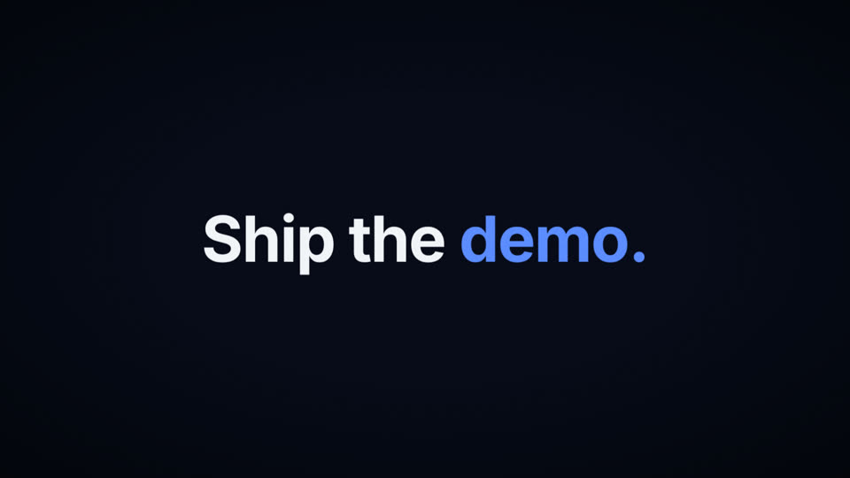

Times are musical: at 120 bpm a beat (`"1b"`) is half a second and a bar (`"1bar"`) is two. The
scene lasts two bars. The headline enters on beat 1 with `wave`: each letter rises, rotates and
settles, one after another.

### Step 2: a ground, music, and a build

```jsonl
{"op":"background","kind":"nebula"}
{"op":"music","key":"F#m","sections":[{"bars":2,"part":"build"},{"bars":2,"part":"drop"}]}
{"op":"particles","scene":"hook","kind":"rays","at":"5b","dur":"3b"}
```

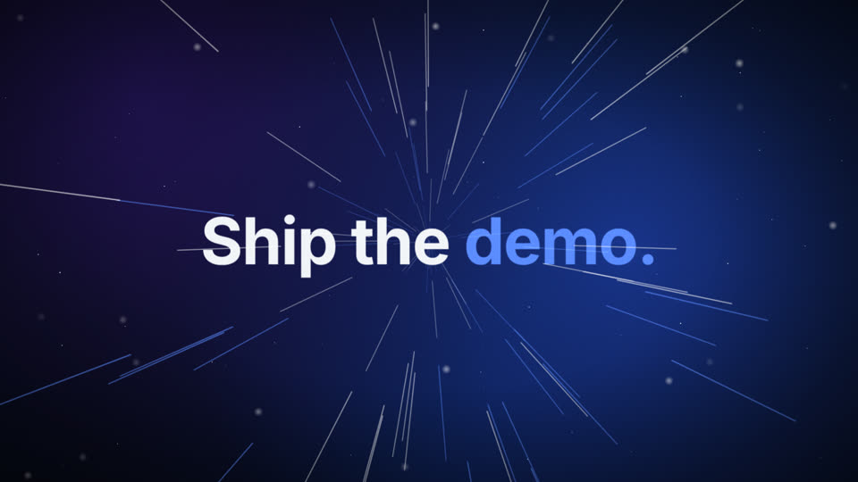

The music has two sections on the same grid as the picture: a two-bar `build` (a riser and a
snare roll that doubles) under the headline, then a `drop`. The rays start on beat 5 and run to
the end of the scene, into the drop.

### Step 3: the product, rebuilt as parts

```jsonl
{"op":"scene","id":"product","dur":"2bar","transition":"flash"}
{"op":"ui","id":"box","scene":"product","kind":"input","w":900,"chips":["GPT","Claude"],"in":{"fx":"rise","at":0}}
{"op":"act","target":"box","do":"type","at":"1b","text":"Record the checkout flow"}
{"op":"act","target":"box","do":"click","sel":".kv-send","at":"6b"}
```

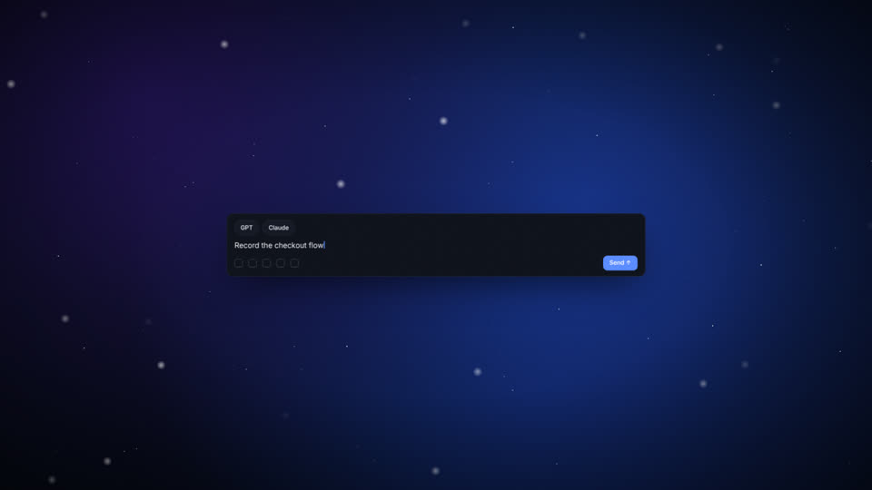

The second scene starts on the drop with a white flash. Instead of a screenshot, the product is
a `ui` component, so each part moves: the box rises in, `type` types into it (with key sounds),
and `click` presses its Send button on beat 6 (with a click and a ripple).

### Step 4: a camera, a headline that stays still, and a hit

```jsonl
{"op":"camera","scene":"product","keys":[{"t":"0.5b","zoom":1},{"t":"1.5b","zoom":1.6,"x":-150,"y":0,"ease":"inOutExpo"},{"t":"5b","zoom":1.6,"x":-150},{"t":"6b","zoom":1.2,"x":0,"ease":"inOutExpo"}]}
{"op":"text","scene":"product","fixed":true,"text":"You write [what happens.]","size":60,"y":"15%","in":{"fx":"mask","at":0,"split":"word","stagger":"0.25b"}}
{"op":"shake","scene":"product","at":0,"dur":"1b","amp":12}
```

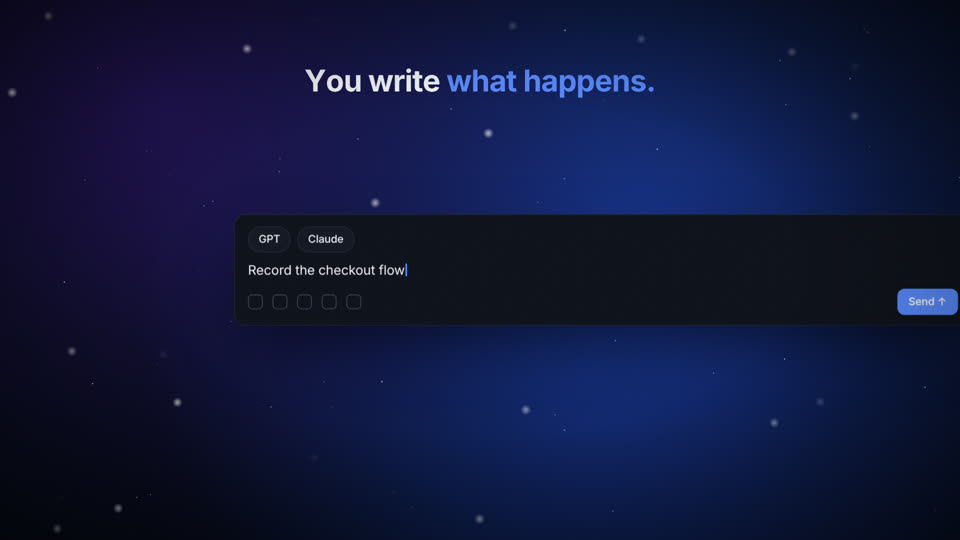

The camera zooms to 1.6× on the text as it types, holds, and pulls back for the click. The
headline is `fixed`, so the zoom does not crop it. The `shake` lands on the drop's first
downbeat, with the flash.

From here, everything in `docs/motion-llm.md` is one more line: orbits of icons with light
trails, 3D walls of cards, confetti, counting stats, a cursor that clicks, sound effects on any
beat.

---

## 5. A hero from real recordings

**The files:** `examples/motion/hero.jsonl`, and `examples/motion/hero-takes.sh`, which films
its takes and renders it. This is the kaviri.dev hero: "Screen Studio for your AI agent".

### Step 1: film the product, on every device

```sh
K=./target/release/kaviri
$K record --script examples/demo.jsonl --slowmo 4 --frame ios --out takes/ios.mp4
$K record --script examples/demo.jsonl --slowmo 4 --frame android --out takes/android.mp4
$K record --script examples/demo.jsonl --slowmo 4 --frame macos --desktop on --dock dev --preset landscape --out takes/macos.mp4
```

The same six-line script, filmed three times. Each take opens wide on the whole handset or
desktop, zooms in to follow the typing, and pulls back out. `--slowmo 4` gives a
software-rendered browser four times the frames.

### Step 2: the launch style and a wall of the site

```jsonl
{"op":"brand","name":"kaviri","accent":"#ff6b3d","accent2":"#f472b6","style":"launch","url":"kaviri.dev","logo":"kaviri-mark-light.svg"}
{"op":"beat","text":"Screen Studio for your [AI agent.]","sub":"Your demo video, filmed from a script.","show":{"wall":["site/hero.png","site/how.png","site/ci.png","site/pricing.png","site/stale.png"]}}
```


`launch` is pure black and thin type, with the `[accent]` words painted in a gradient from
`accent` to `accent2`. `wall` tilts the pictures into a drifting 3D wall behind the headline.

### Step 3: every device, side by side

```jsonl
{"op":"beat","text":"Every [device.]","bars":3,"show":{"devices":["takes/ios.mp4","takes/android.mp4","takes/macos.mp4"],"labels":["iOS","Android","macOS"]}}
```

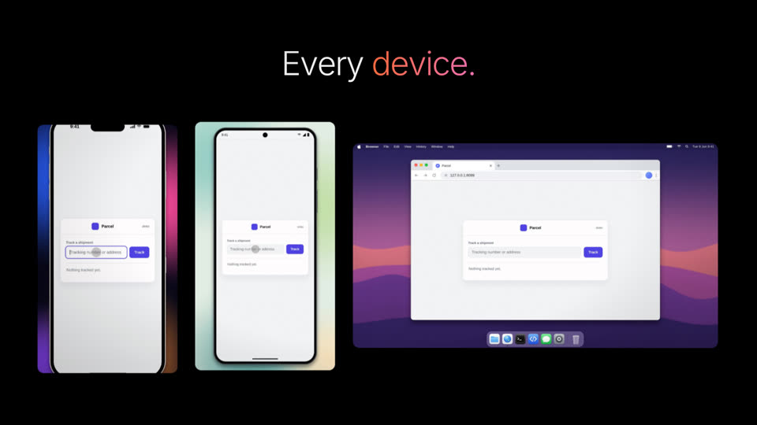

`devices` plays each take across the beat (`"bars":3` makes it six seconds, so the whole
take fits without rushing), each flying in half a beat after the last.

### Step 4: one take, big

```jsonl
{"op":"beat","text":"The camera [follows the caret.]","bars":3,"sub":"Every zoom comes from what happened. Nobody chose a camera move.","show":{"clip":"takes/macos.mp4"}}
```

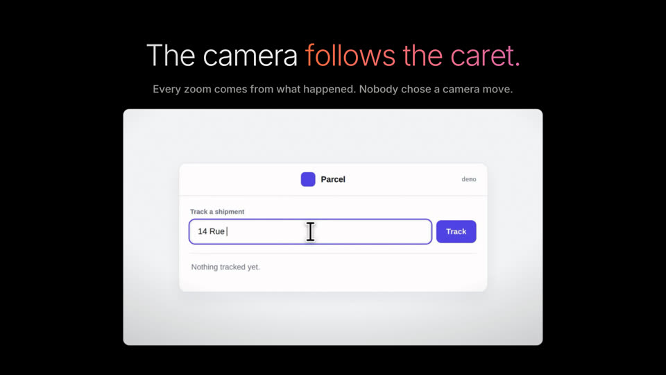

### Step 5: a word that keeps changing, and the end

```jsonl
{"op":"beat","text":"Made for every","show":{"cycle":["agent.","developer.","CI run."],"around":["site/hero.png","site/ci.png","site/how.png","site/pricing.png"]}}
{"op":"end","tagline":"Screen Studio for your [AI agent.]"}
```

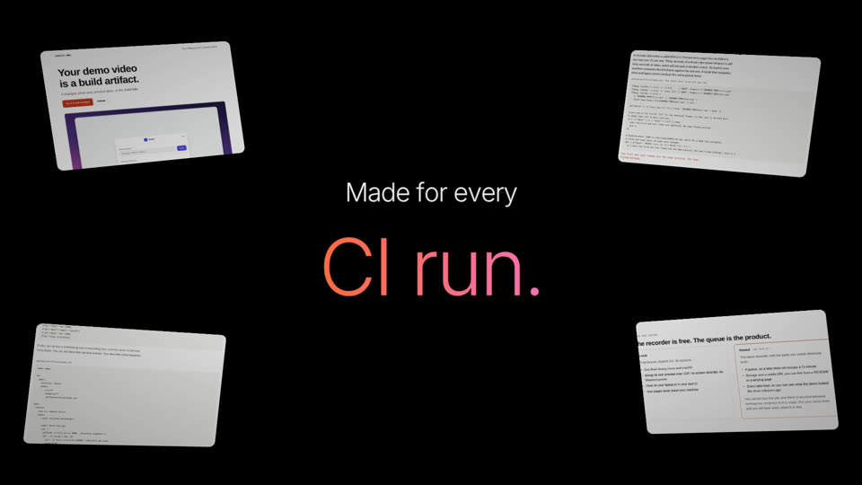

`cycle` swaps the big word on the beat; the end card in `launch` sits on a field of sparkles.

---

## 6. An internal launch template

**The file:** `examples/motion/internal-launch.jsonl`.

A team that ships every few weeks wants one launch video mechanism, not a new edit each time.

### Step 1: variables

```jsonl
{"op":"vars","product":"Relay","team":"Support Tools","color":"#e0457b","url":"go/relay"}
{"op":"brand","name":"{{product}}","accent":"{{color}}","url":"{{url}}"}
```

`{{product}}` works in any text. The `vars` line holds the defaults, and the command line
overrides them: `--var product=Beacon --var color=#2563eb` makes Beacon's video from the same file.

### Step 2: choices

```jsonl
{"op":"brand","name":"{{product}}","accent":"{{color}}","style":{"$pick":["gallery","launch","bold","announcement","editorial"]}}
{"op":"beat","text":{"$pick":["Meet [{{product}}.]","Say hello to [{{product}}.]","Introducing [{{product}}.]"]},"sub":"From {{team}}."}
{"op":"beat","$maybe":0.6,"text":"Try it [today.]","show":{"list":["Open {{url}}","Sign in with SSO"]}}
```

`$pick` chooses one value; it can hold words, a style, a whole `show`, or anything else.
`"$weights":[3,1]` biases it. `$maybe` keeps a line only some of the time.

### Step 3: compare, then choose

```sh
kaviri motion --script internal-launch.jsonl --variants 4 --still 4.5,10.5 --out look.png
```

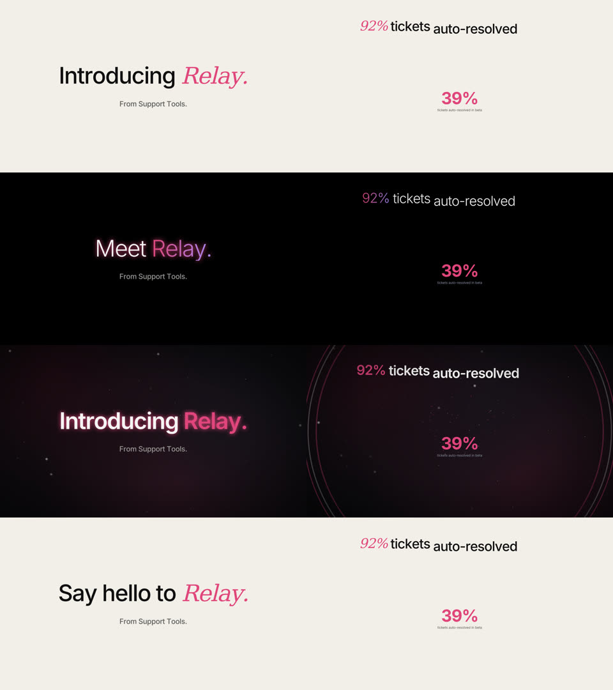

Each variant is a seed. `--check` prints the choices a seed made. When one looks right, render
it: `kaviri motion --script internal-launch.jsonl --seed 3 --out relay.mp4`. The same seed always
makes the same video, and each choice depends only on its own line, so fixing a typo on line 4
does not change what line 2 picked.

### The gallery style

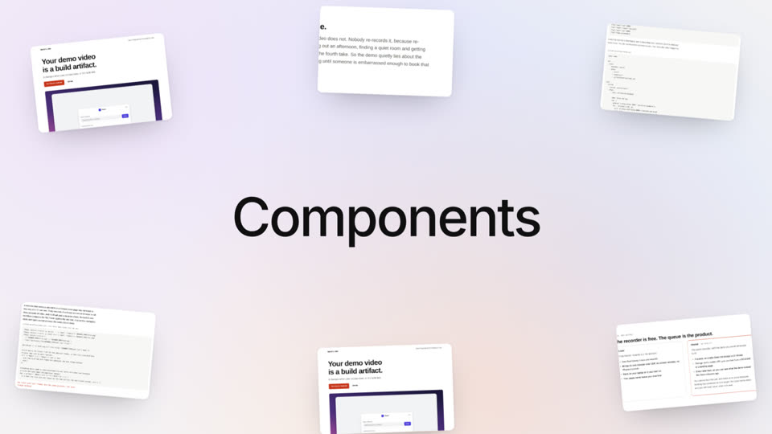

`examples/motion/gallery.jsonl` shows the `gallery` style, a natural pick for internal launches:
the logo turning in (`"intro":"logo"`), words among floating screenshots (`float`), a camera
gliding over the product (`"pan":true` on an `image`), big numbers over a wall (`wall` with
`stats`), and the site's links on the end card.
